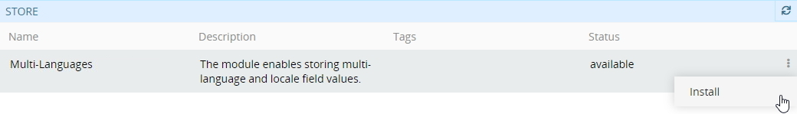
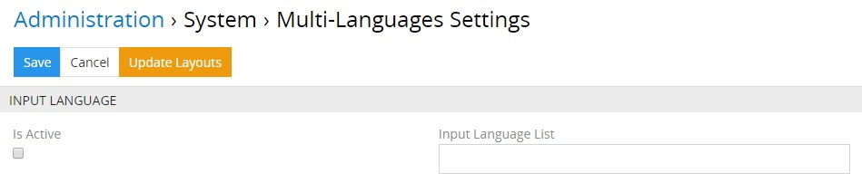
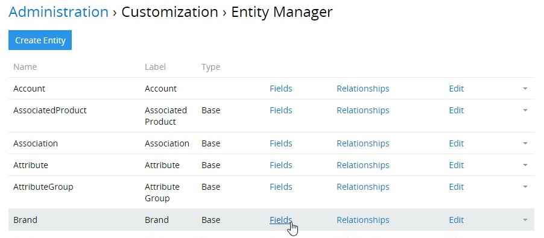

Das Modul „Multi-Languages“  ermöglicht es, Sprachen einzufügen und mehrsprachige Felder der Typen `Array MultiLang`, `Enum Multilang`, `Multi-Enum Multilang`, `Text Multilang`, `Varchar MultiLang`, oder `Wysiwyg MultiLang` für jede Entität im System zu erstellen. 

## Installationsanleitung 

Um das Modul „Multi-Languages“ in Ihrem System zu installieren, gehen Sie zu `Administration > Modulmanager`; suchen Sie dieses Modul in der Liste „Shop“ und klicken Sie auf `Installieren`:

Wählen Sie im angezeigten Installations-Pop-up die gewünschte Version aus und klicken Sie auf den Button `Installieren`. Der Modulhintergrund wird grün und in den Bereich „installiert“ des Modulmanagers verschoben. Klicken Sie auf `das Update starten`, um die Installation zu bestätigen.

Bitte beachten Sie, dass nach dem Systemupdate alle Nutzer abgemeldet werden. 

Um das Modul „Multi-Languages“ zu aktualisieren / zu entfernen, nutzen Sie die entsprechenden Optionen aus der Menü für einzelne Datensatzaktionen `Administration > Modulmanager`.

*Bitte beachten Sie, dass das Modul „Multi-Languages“ zusammen mit TreoPIM installiert werden kann und PIM-abhängig ist. Wenn also ein PIM im System installiert ist, kann das Modul „Multi-Languages“ nicht entfernt werden.*

## Funktionen für den Administrator  

### Konfiguration des Moduls 

Um die mehrsprachigen Einstellungen zu konfigurieren, gehen Sie zu  `Administration > Multi-languages`:

Wenn die Produktinformationen in nur einer Sprache eingegeben werden, sind die Checkbox `Aktiv` und das Feld `Spracheingabe Liste` deaktiviert (siehe Abbildung oben).

Um die Funktion zur Eingabe von Feldwerten in mehreren Sprachen zu aktivieren, setzen Sie die Checkbox `Aktiv` und wählen Sie die gewünschten Sprachen aus der Drop-down-Liste aus, die angezeigt wird, nachdem Sie auf die `Spracheingabe Liste` geklickt haben:

Um die Sprachen zu ändern, für die die mehrsprachigen Felder ausgefüllt werden müssen (z.B. vorher definierte Locales entfernen, neue hinzufügen), nutzen Sie ebenfalls die Einstellung  `Spracheingabe Liste`. 

Wenn zu jedem mehrsprachigen Feld eine neue Sprache hinzugefügt wird, wird auf den Seiten zum Erstellen / Bearbeiten von Entitäten ein neues Eingabefeld (ohne Werte) angezeigt: 

Die Namen von mehrsprachigen Feldern enthalten den Namen ihres Locales: „en_US“, „de_DE“ usw.

*Wenn das mehrsprachige Feld ein Pflichtfeld ist, ist die Eingabe von Werten für alle aktivierten Sprachen im TreoCore-System ebenfalls erforderlich.*

Beim Ausschalten einer bestimmten Sprache oder bei der Entfernung des Moduls „Multi-Languages“ werden das Eingabefeld und dessen Wert aus der Datenbank und dem Systeminterface entfernt. Wenn diese Sprache jedoch wieder eingeschaltet oder das Modul neu installiert wird, werden die Eingabefelder im Systeminterface wiederhergestellt, aber ohne die vorher eingegebenen Daten. Also, seien Sie bitte vorsichtig mit diesen Aktionen.

### Mehrsprachige Felderstellung 

Um ein mehrsprachiges Feld zu erstellen, gehen Sie zu  `Administration > Entity Manager` und klicken Sie bei der gewünschten Entität auf `Felder`:

Im angezeigten Fenster werden alle Felder der ausgewählten Entität eingeblendet. Klicken Sie auf den Button `Feld hinzufügen`, wählen Sie die mehrsprachigen Feldtypen aus und geben Sie alle für diesen Typ erforderlichen Metadaten an:

Derzeit stehen im TreoCore-System die folgenden mehrsprachigen Feldtypen zur Verfügung:

| Feldtyp              | Beschreibung                             |
| -------------------- | ---------------------------------------- |
| Array MultiLang      | Der Feldtyp zum Speichern mehrsprachiger Textwerte des dynamischen Datensatzes (der Nutzer kann beim Bearbeiten des Feldes manuell einen oder einige Werte hinzufügen oder speichern). |
| Enum MultiLang       | Der Feldtyp zum Speichern mehrsprachiger Werte der Drop-down-Liste mit der Möglichkeit, nur eine der Varianten auszuwählen. |
| Multi-Enum MultiLang | Der Feldtyp zum Speichern mehrsprachiger Werte der Drop-down-Liste mit der Möglichkeit, eine oder mehrere Varianten auszuwählen. |
| Text MultiLang       | Der Feldtyp zum Speichern langer mehrsprachiger Textwerte |
| Varchar MultiLang    | Der Feldtyp zum Speichern kurzer mehrsprachiger Textwerte (bis zu 255 Symbole) |
| Wysiwyg MultiLang    | Der Feldtyp zum Speichern langer mehrzeiliger Texte, enthält einen integrierten Texteditor mit separaten Werten für jedes Locale |

*Wenn Ihr System bereits in ein externes System integriert ist und Sie anstelle des einfachen Felds (z.B. Produktname) ein mehrsprachiges Feld hinzufügen, müssen Sie möglicherweise das Mapping ändern, um die korrekte Arbeit mit den externen Systemen sicherzustellen.*

Beachten Sie bitte, dass nach dem Entfernen des Moduls „Multi-Languages“ aus dem System mehrsprachige Felder für die konfigurierten Entitäten bleiben werden, die Auswahl der Locales wird jedoch nicht mehr möglich sein. Bei der Neuinstallation des Moduls werden alle vorherigen Werte von mehrsprachigen Feldern zusammen mit Locales wiederhergestellt.

Die Anzahl der Auswahlvarianten oder die Anzahl der Eingabewerte in den Feldern  `Array MultiLang`, `Enum MultiLang`, und `Multi-Enum MultiLang` muss für alle Sprachen gleich sein. Die semantische Übereinstimmung der Feldwerte in verschiedenen Sprachen kann vom System nicht überprüft werden, daher muss dies vom Administrator kontrolliert werden. Beispielsweise muss der erste Standardwert des Feldes „eins“ mit dem ersten Standardwert des englischen Feldes „one“ übereinstimmen.

### Mehrsprachige Feldanzeige im Layout

Um die neu erstellten Felder anzuzeigen, gehen Sie zu  `Administration > Layout Manager` und klicken Sie auf die gewünschte Entität in der Liste, um die Liste der für diese Entität verfügbaren Layouts aufzuklappen. Klicken Sie auf das Layout, das Sie konfigurieren möchten (z.B. `Liste`), und aktivieren Sie das erstellte Feld durch drag-and-drop von der rechten Spalte in die linke:

Klicken Sie auf `Save` um den Vorgang abzuschließen. Das hinzugefügte mehrsprachige Feld wird im konfigurierten Layouttyp für die gegebene Entität angezeigt:

Um die Feldanzeige für andere Layouttypen der Entität anzupassen, nehmen Sie ähnliche Änderungen an den gewünschten Layouttypen im Layout-Manager vor, wie oben beschrieben.

## Funktionen für den Nutzer

Jedes mehrsprachige Feld hat einen Standardwert und zusätzliche Sprachfelder (deren Anzahl entspricht der Anzahl von aktivierten Sprachen). Der Standardwert des mehrsprachigen Felds ist keiner Sprache zugeordnet.

Auf der Entitätsdetailseite wird nur der Wert des Hauptfeldes angezeigt, und die Werte anderer Sprachfelder werden ausgeblendet:

Um alle Sprachfelder mit ihren Werten aufzuklappen, klicken Sie auf den Button zur Erweiterung. 

Die möglichen Werte der Felder `Enum MultiLang` und `Multi-Enum MultiLang` werden vom [Administrator](#administrator-functions) für jede Sprache angegeben. Die Nutzer können nur bei der Bearbeitung aus den vorhandenen Werten auswählen:

Für die Felder der Typen `Text MultiLang`, `Varchar MultiLang`, und `Wysiwyg MultiLang` werden zusätzliche Eingabefelder für alle Sprachen eingefügt, die in den [Moduleinstellungen](#module-configuration) aktiviert und von den Usern ausgefüllt werden.

Beim Speichern der leeren mehrsprachigen Felder der Typen `Text MultiLang`, `Varchar MultiLang`, und `Wysiwyg MultiLang` werden diese automatisch mit den Werten aus dem Hauptfeld gefüllt. 

Wenn Sie TreoPIM auf Ihrem System installieren, können Sie nicht nur mit mehrsprachigen Feldern arbeiten, sondern auch mehrsprachige [Attribute](https://treopim.com/help/attributes) erstellen:

Erfahren Sie mehr über TreoPIM und seine Vorteile [hier](https://treopim.com/help/what-is-treopim).

**Installieren Sie jetzt das Modul „Multi-Languages“, um Ihre Felder und deren Werte in so vielen Sprachen wie benötigt auf dem neuesten Stand zu halten! **
