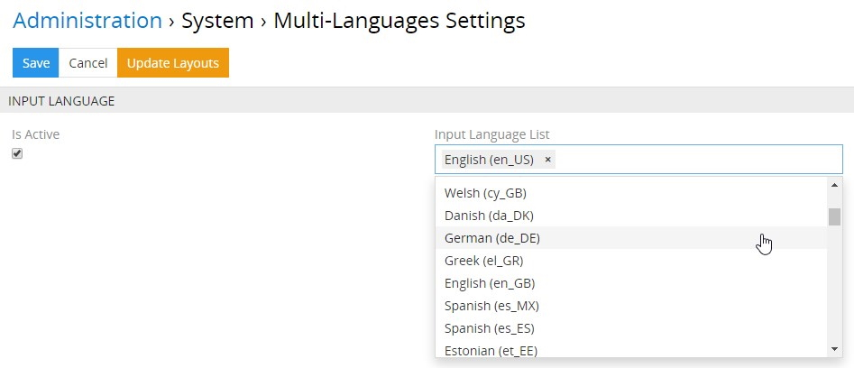
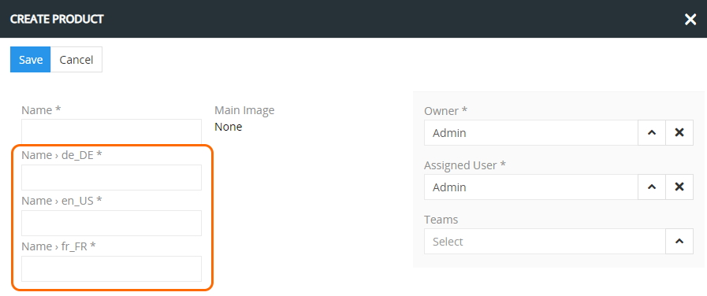
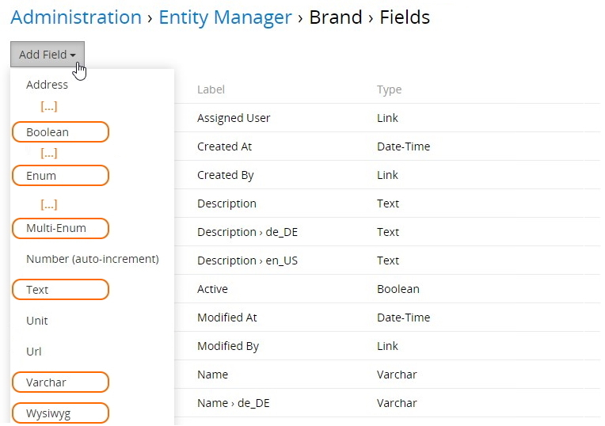
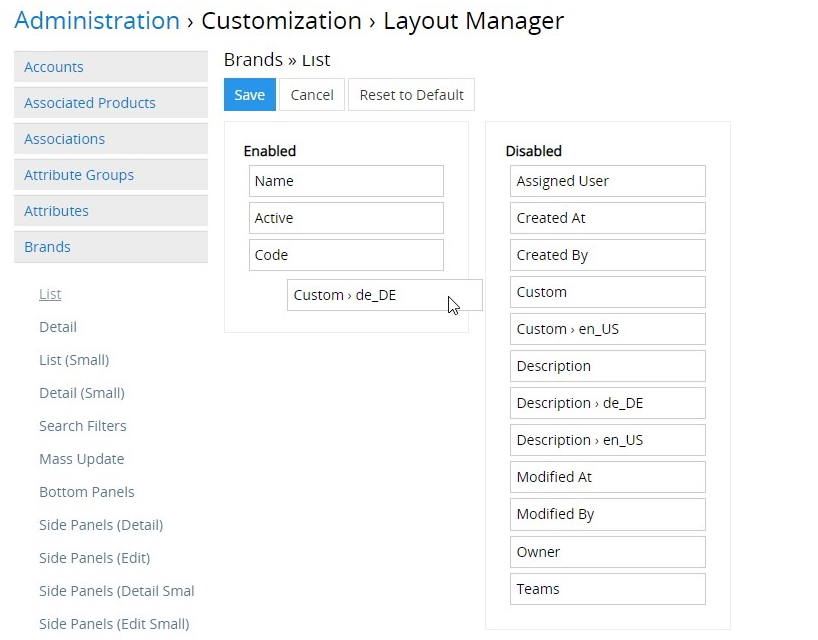

# Multi-Languages 

The "Multi-Languages" module allows you to add languages and create multi-language fields of the `Array MultiLang`, `Enum MultiLang`, `Multi-Enum MultiLang`, `Text MultiLang`, `Varchar MultiLang`, or `Wysiwyg MultiLang` types for any entity in the system. 

## Installation Guide 

To install the "Multi-Languages" module to your system, go to `Administration > Module Manager`, find this module in the "Store" list and click `Install`:

Select the desired version in the installation pop-up window that appears and click the `Install` button. The module background will turn green and it will be moved to the "Installed" section of the Module Manager. Click `Run update` to confirm its installation.

Please, note that running the system update will lead to the logout of all users.

To update/remove the "Multi-Languages" module from the system, use the corresponding options from its single record actions drop-down list in `Administration > Module Manager`.

*Please, note that the "Multi-Languages" module can also be installed together with TreoPIM and it is PIM dependent, i.e. if PIM is still installed in the system, the "Multi-Languages" module cannot be removed.*

## Administrator Functions 

### Module Configuration 

To configure the multi-language settings, go to `Administration > Multilang > Settings`:

If product information is entered only in one language, the `Is active` checkbox and the `Input language list` field are deactivated, as shown on the screenshot above.

To enable the function for inputting the field values in multiple languages, select the `Is active` checkbox and choose the desired languages from the drop-down list that appears after you click the `Input language list` field:

To change the languages for which the multi-language fields must be filled (e.g. delete the previously defined locales, add new ones), also use the `Input Language List` setting. 

When a new language is added to each multi-language field, a new input field (without values) is displayed on the entity creation/editing pages:

Names of multi-language fields include the name of their locale: "en_US", "de_DE", etc.

*If the multi-language field is mandatory, input of values for all activated languages in the TreoPIM system is also mandatory.*

When turning off a certain language, the input field and its value will be removed from the layout. However, if this language is turned on again, the previously entered values will be restored. 

### Multi-Language Field Creation 

To create a multi-language field, go to `Administration > Entity Manager` and click `Fields` for the desired entity:

In the new window that opens, all fields of the selected entity are displayed. Click the `Add Field` button, select the multi-language field types and specify all necessary metadata for this type:

Currently the following multi-language field types are available in the TreoPIM system:

| Field Type            | Description                              |
| --------------------- | ---------------------------------------- |
| Array MultiLang       | Field type for storing multi-language text values of the dynamic data set (the user can manually add or save a value or some values when editing the field) |
| Enum MultiLang       | Field type for storing multi-language values of the drop-down list with the possibility to select only one of the variants |
| Multi-Enum MultiLang | Field type for storing multi-language values of the drop-down list with the possibility to select one or more variants |
| Text MultiLang       | Field type for storing long multi-language text values |
| Varchar MultiLang    | Field type for storing short multi-language text values (up to 255 characters) |
| Wysiwyg MultiLang    | Field type for storing long multiline texts that contains a built-in text editor with separate values for each locale |

*If your system is already integrated with an external system, and you add a multi-language field instead of the simple field (for example, product name), you may need to change the mapping to ensure correct work with the external systems.*

Please, note that if the "Multi-Languages" module is removed from the system, multi-language fields for the configured entities remain, but the choice of locales becomes unavailable. When the module is re-installed, all the previous multi-language fields values are restored along with locales.

The number of variants for selection or the number of input values in the  `Array MultiLang`, `Enum MultiLang`, and `Multi-Enum MultiLang` fields must be the same in all languages. The semantic match of the field values in different languages cannot be checked by the system, so this must be controlled by the administrator. For instance, the first default value of the field "one" must match the first default value of the German field "eins". 

### Multi-Language Field Display on the Layout

To display the newly created field(s), go to `Administration > Layout Manager` and click the desired entity in the list to unfold the list of layouts available for this entity. Click the layout you wish to configure (e.g. `List`) and enable the created  field by its drag-and-drop from the right column to the left:

Click `Save` to complete the operation. The added multi-language field will be displayed on the configured layout type for the given entity:

To customize the fields display for other layout types of the entity, make similar changes to the desired layout types in the Layout Manager, as described above. 

## User Functions

Each multi-language field has a default value and additional language fields (their number equals the number of languages that have been activated). The default value of the multi-language field is not attached to any language.

Only the main field value is displayed on the entity detail view page, and the values of other language fields are hidden:

To unfold all language fields with their values, click the expand button:

The possible values of the `Enum MultiLang` and `Multi-Enum MultiLang` fields are specified for each language by the [administrator](#administrator-functions). Users can only select from the existing values while editing:

For the fields of the `Text MultiLang`, `Varchar MultiLang`, and `Wysiwyg MultiLang` types, the additional input fields are added for all languages that have been activated in the [module settings](#module-configuration) and that are filled in by the users.  

While saving the empty multi-language fields of the `Text MultiLang`, `Varchar MultiLang`, and `Wysiwyg MultiLang` types, they are automatically filled in with the values from the main field. 

In addition to operating with multilingual fields, installing TreoPIM to your system will allow you to create multilingual [attributes](https://treopim.com/help/attributes):

Learn more about TreoPIM and its advantages [here](https://treopim.com/help/what-is-treopim).

***Install the "Multi-Languages" module now to keep your fields and their values up-to-date in as many languages as needed!***
